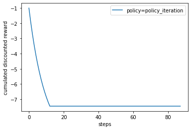
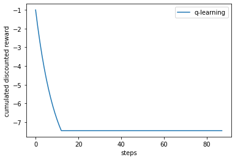

# Reinforcement learning
Introduction to RL models by discovering OpenAI GYM with an implementation of Value Iteration, Policy Iteration
and Q-learning. 

The environment implemented is Cliff Walking Environment (from Sutton's book).

    Adapted from Example 6.6 (page 132) from Reinforcement Learning: An Introduction
    by Sutton and Barto:
    The board is a 4x12 matrix, with (using Numpy matrix indexing):
        [3, 0] as the start at bottom-left
        [3, 11] as the goal at bottom-right
        [3, 1..10] as the cliff at bottom-center
    Each time step incurs -1 reward, and stepping into the cliff incurs -100 reward
    and a reset to the start. An episode terminates when the agent reaches the goal.
The idea is to reach the goal and avoid the cliff. Each episode represents a trail by the agent in its pursuit to reach the goal.
An episode ends once the agent reaches a terminal state. 

You can find the code in: [Cliff_walking](Cliff_walking)

## Overview of the methods
Policy: 
$\pi(s,a) = Pr(a=a|s=s)$
Value function: 
$V_{\pi}(s)=\mathbb{E}[\sum_{t=1}^n\gamma^tr(s_{t})]$
The value function denoted as v(s) under a policy π represents how good a state is for an agent to be in. In other words, what is the average reward that the agent will get starting from the current state under policy π?\
The objective of RL is to find the optimal pollicy to maximize future rewards. 

### Model based RL with Markov Decision Process
Any random process in which the probability of being in a given state depends only on the previous state, is a markov process.
In other words, in the markov decision process setup, the environment’s response at time 
t+1 depends only on the state and action representations at time t, and is independent of whatever happened in the past.\
We have a deterministic propability $P(s',s,a)$ function which defines the probability of moving from state $s$ to state $s'$ given action $a$.\
The model basded algortithme is based on Bellman's function and Dynamic programming.\
Dynamic programming has a table which stores the deterministic probabilities that our actions haves. If we choose
an action, we know exactly with which probability we land in which state.
* DP can only be used if the model of the environment is known(which is our case)
* Has a very high computational expense

#### Value iteration
* Initialize Value function with zero to every possible states
* Iterate over each state until it converge to such tolerance 
* Output a deterministic policy which maximzes the value function 

#### Policy iteration
* Randomly initialize the policy 
* Two step plicy 
    * Iteratively update the value function by locking in that policy (policy evaluation)
    * Iteratively update the policy function by locking the value function until convergence (policy improvement)

### Model free RL with Q-learning
Introduce of a $Q$ function, which is a joint possibility of state/action pair. 
$$Q(s,a)= \mathbb{E}(R(s',s,a)+\gamma v(s'))$$
While the policy iteration and value iteration need to have a model of what the future state $s'$ is so that we can use that value to the next state by recursive dynamic programming, the quality function
have all these information implicitly in the function so we can optimize directly and learn iterate this quality function and iteratively improve it. 
For each state do:
$$ \pi^{*}: select a^{*} where Q^{*}(s,a^{*})=max_{a}Q^{*}(s,a) $$
The Q learning is consisted of the following steps: 
* Select an action
* Update the Q[s,a] table
* Train the model iteratively

The strategy of choosing action in Q learning is called <b>exploration</b> based on $\epsilon$. It follows a binominal distribution, which
means, for example, there is 20% of chance the agent will take random action and 80% chance the agent will do the action with the highest Q-value.
The latter is known as <b>exploitation</b>.

## Comparison of the results
* Value iteration and Q-learning are powerful reinforcement learning algorithms that can enable an agent to learn autonomously.
* Value iteration led to faster learning than the Q-learning algorithm.

### Cumulative discounted rewrd over time

We find that after trainnin and fine tuning the Q-learning model, the agent find the optimal policy for both model free and model based algorithme. 

# Credits 
[Marwan Mashra](https://github.com/MarwanMashra)

 

